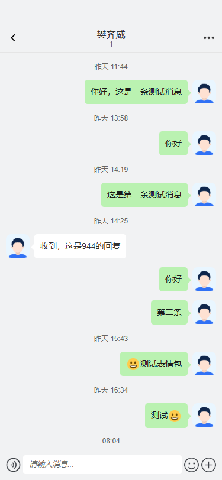
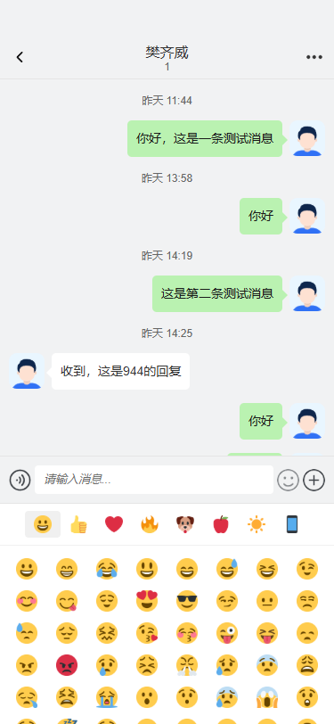
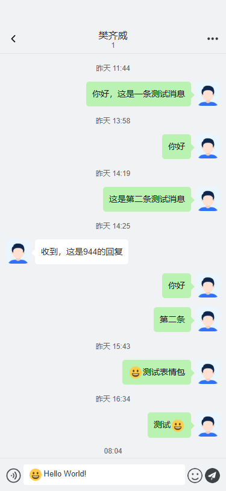

# uni-chat-room

<p align="center">
  
  
  
</p>

<p align="center">
  <a href="https://www.npmjs.com/package/uni-chat-room"></a>
  <a href="https://www.npmjs.com/package/uni-chat-room"></a>
  <a href="https://github.com/2582767744/uni-chat-room/blob/main/LICENSE"></a>
</p>

<p align="center">
  <a href="#english">English</a> | <a href="#中文">中文</a>
</p>

---

<h2 id="english">English</h2>

A feature-rich chat room component for uni-app, supporting emoji, images, videos, voice messages, and more.

### Features

- 🎨 **Rich Message Types** - Text, image, video, voice, card messages
- 😊 **Emoji Support** - 200+ built-in emoji with image fallback
- 📱 **Cross-Platform** - Works on H5, WeChat Mini Program, App
- 🎯 **Auto-resize Input** - Input box grows with content (up to 10 lines)
- ⚡ **Lightweight** - ~25KB gzipped
- 🔧 **Customizable** - Flexible props and slots

### Installation

```bash
npm install uni-chat-room
# or
pnpm add uni-chat-room
# or
yarn add uni-chat-room
```

### Quick Start

```vue
<template>
  <ChatRoom
    :messages="messages"
    :current-user="currentUser"
    :target-user="targetUser"
    @send="onSend"
    @send-image="onSendImage"
  />
</template>

<script setup>
import { ref } from 'vue'
import { ChatRoom } from 'uni-chat-room'
import 'uni-chat-room/style.css'

const messages = ref([
  { id: 1, type: 'text', content: 'Hello!', sender: 'other' },
  { id: 2, type: 'text', content: 'Hi there! How can I help?', sender: 'self' },
])

const currentUser = { id: 1, avatar: '/avatar/me.png' }
const targetUser = { id: 2, avatar: '/avatar/other.png' }

const onSend = (message) => {
  messages.value.push({
    id: Date.now(),
    type: 'text',
    content: message.content,
    sender: 'self'
  })
}

const onSendImage = (file) => {
  console.log('Send image:', file)
}
</script>
```

### Emoji Resources

Copy the `static/emoji` folder to your project's static directory.

### Props

| Prop | Type | Default | Description |
|------|------|---------|-------------|
| messages | `ChatMessage[]` | `[]` | Message list |
| currentUser | `Object` | - | Current user info |
| targetUser | `Object` | - | Target user info |
| showEmoji | `boolean` | `true` | Show emoji button |
| showPlus | `boolean` | `true` | Show plus button |
| enableVoice | `boolean` | `false` | Enable voice input |
| placeholder | `string` | `'Type a message...'` | Input placeholder |
| emojiBasePath | `string` | `'/static/emoji'` | Emoji assets path |
| maxLines | `number` | `10` | Max input lines |

### Events

| Event | Payload | Description |
|-------|---------|-------------|
| send | `{ type, content, html }` | Send text message |
| sendImage | `{ url, type }` | Send image |
| sendVideo | `{ url, type, thumbnail }` | Send video |
| sendVoice | `{ url, duration }` | Send voice |
| messageClick | `message` | Message clicked |
| cardAction | `message` | Card action clicked |
| inputChange | `content` | Input content changed |
| loadMore | - | Load more messages |

### Message Types

```typescript
interface ChatMessage {
  id: string | number
  type: 'text' | 'image' | 'video' | 'voice' | 'card' | 'tip'
  content: string
  sender: 'self' | 'other'
  avatar?: string
  nickname?: string
  timestamp?: number
  status?: 'sending' | 'sent' | 'failed'
  mediaUrl?: string
  mediaThumbnail?: string
  voiceDuration?: number
  card?: {
    title: string
    status: string
    statusType?: string
    days?: string
    range?: string
    actionText?: string
  }
}
```

### Individual Components

```vue
<template>
  <!-- Emoji Picker only -->
  <EmojiPicker @select="onEmojiSelect" />
  
  <!-- Message Bubble only -->
  <MessageBubble :message="message" />
</template>

<script setup>
import { EmojiPicker, MessageBubble } from 'uni-chat-room'
</script>
```

### Utility Functions

```typescript
import { 
  parseEmojiText,  // Parse emoji in text
  getEmojiUrl,     // Get emoji image URL
  getEmojiName,    // Get emoji name
  htmlToText       // Convert HTML to plain text
} from 'uni-chat-room'

// Parse "[smile]Hello" -> [{ type: 'emoji', code: '1f600' }, { type: 'text', content: 'Hello' }]
const parts = parseEmojiText('[微笑]Hello')
```

### Custom Emoji

You can customize emoji categories by passing your own configuration:

```vue
<template>
  <ChatRoom
    :messages="messages"
    :emoji-categories="customEmojis"
    emoji-base-path="/my-emoji"
    @send="onSend"
  />
  
  <!-- Or use EmojiPicker directly -->
  <EmojiPicker
    :categories="customEmojis"
    base-path="/my-emoji"
    :columns="10"
    @select="onEmojiSelect"
  />
</template>

<script setup>
// Define custom emoji categories
const customEmojis = [
  {
    name: 'Favorites',
    emojis: [
      { code: 'happy', name: 'Happy' },
      { code: 'sad', name: 'Sad' },
      { code: 'love', name: 'Love' },
    ]
  },
  {
    name: 'Animals',
    emojis: [
      { code: 'cat', name: 'Cat' },
      { code: 'dog', name: 'Dog' },
      { code: 'bird', name: 'Bird' },
    ]
  }
]

// Make sure your emoji images are at:
// /my-emoji/happy.png
// /my-emoji/sad.png
// /my-emoji/love.png
// etc.

const onEmojiSelect = ({ code, name }) => {
  console.log(`Selected: ${name} (${code})`)
  // Insert [name] into your input
}
</script>
```

**Custom Emoji Structure:**

```
your-project/
├── static/
│   └── my-emoji/           # Your custom emoji folder
│       ├── happy.png       # Image file name = code
│       ├── sad.png
│       ├── love.png
│       ├── cat.png
│       └── ...
```

**Type Definition:**

```typescript
interface EmojiCategory {
  name: string              // Category display name
  emojis: EmojiItem[]       // Emoji list
}

interface EmojiItem {
  code: string              // Emoji code (matches image filename)
  name: string              // Emoji display name (used as [name] in text)
}
```

---

<h2 id="中文">中文</h2>

一个功能丰富的 uni-app 聊天室组件，支持表情、图片、视频、语音等多种消息类型。

### 特性

- 🎨 **丰富的消息类型** - 文本、图片、视频、语音、卡片消息
- 😊 **表情支持** - 内置 200+ 表情，支持图片降级
- 📱 **跨平台** - 支持 H5、微信小程序、App
- 🎯 **自适应输入框** - 输入框随内容增长（最多 10 行）
- ⚡ **轻量级** - gzip 后约 25KB
- 🔧 **可定制** - 灵活的 props 和插槽

### 安装

```bash
npm install uni-chat-room
# 或
pnpm add uni-chat-room
# 或
yarn add uni-chat-room
```

### 快速开始

```vue
<template>
  <ChatRoom
    :messages="messages"
    :current-user="currentUser"
    :target-user="targetUser"
    @send="onSend"
    @send-image="onSendImage"
  />
</template>

<script setup>
import { ref } from 'vue'
import { ChatRoom } from 'uni-chat-room'
import 'uni-chat-room/style.css'

const messages = ref([
  { id: 1, type: 'text', content: '你好！', sender: 'other' },
  { id: 2, type: 'text', content: '你好，有什么可以帮你的？', sender: 'self' },
])

const currentUser = { id: 1, avatar: '/avatar/me.png' }
const targetUser = { id: 2, avatar: '/avatar/other.png' }

const onSend = (message) => {
  messages.value.push({
    id: Date.now(),
    type: 'text',
    content: message.content,
    sender: 'self'
  })
}

const onSendImage = (file) => {
  console.log('发送图片:', file)
}
</script>
```

### 表情资源

将 `static/emoji` 文件夹复制到你的项目 static 目录下。

### Props 属性

| 属性 | 类型 | 默认值 | 说明 |
|------|------|--------|------|
| messages | `ChatMessage[]` | `[]` | 消息列表 |
| currentUser | `Object` | - | 当前用户信息 |
| targetUser | `Object` | - | 对方用户信息 |
| showEmoji | `boolean` | `true` | 是否显示表情按钮 |
| showPlus | `boolean` | `true` | 是否显示更多功能按钮 |
| enableVoice | `boolean` | `false` | 是否启用语音输入 |
| placeholder | `string` | `'请输入消息...'` | 输入框占位文字 |
| emojiBasePath | `string` | `'/static/emoji'` | 表情资源路径 |
| maxLines | `number` | `10` | 输入框最大行数 |

### Events 事件

| 事件 | 参数 | 说明 |
|------|------|------|
| send | `{ type, content, html }` | 发送文本消息 |
| sendImage | `{ url, type }` | 发送图片 |
| sendVideo | `{ url, type, thumbnail }` | 发送视频 |
| sendVoice | `{ url, duration }` | 发送语音 |
| messageClick | `message` | 点击消息 |
| cardAction | `message` | 点击卡片操作 |
| inputChange | `content` | 输入内容变化 |
| loadMore | - | 加载更多消息 |

### 消息类型

```typescript
interface ChatMessage {
  id: string | number
  type: 'text' | 'image' | 'video' | 'voice' | 'card' | 'tip'
  content: string
  sender: 'self' | 'other'
  avatar?: string
  nickname?: string
  timestamp?: number
  status?: 'sending' | 'sent' | 'failed'
  mediaUrl?: string
  mediaThumbnail?: string
  voiceDuration?: number
  card?: {
    title: string
    status: string
    statusType?: string
    days?: string
    range?: string
    actionText?: string
  }
}
```

### 单独使用组件

```vue
<template>
  <!-- 只使用表情选择器 -->
  <EmojiPicker @select="onEmojiSelect" />
  
  <!-- 只使用消息气泡 -->
  <MessageBubble :message="message" />
</template>

<script setup>
import { EmojiPicker, MessageBubble } from 'uni-chat-room'
</script>
```

### 工具函数

```typescript
import { 
  parseEmojiText,  // 解析文本中的表情
  getEmojiUrl,     // 获取表情图片URL
  getEmojiName,    // 获取表情名称
  htmlToText       // HTML转纯文本
} from 'uni-chat-room'

// 解析 "[微笑]你好" -> [{ type: 'emoji', code: '1f600' }, { type: 'text', content: '你好' }]
const parts = parseEmojiText('[微笑]你好')
```

### 自定义表情包

你可以通过传入自定义配置来使用自己的表情包：

```vue
<template>
  <ChatRoom
    :messages="messages"
    :emoji-categories="customEmojis"
    emoji-base-path="/my-emoji"
    @send="onSend"
  />
  
  <!-- 或者单独使用 EmojiPicker -->
  <EmojiPicker
    :categories="customEmojis"
    base-path="/my-emoji"
    :columns="10"
    @select="onEmojiSelect"
  />
</template>

<script setup>
// 定义自定义表情分类
const customEmojis = [
  {
    name: '常用',
    emojis: [
      { code: 'happy', name: '开心' },
      { code: 'sad', name: '难过' },
      { code: 'love', name: '爱心' },
    ]
  },
  {
    name: '动物',
    emojis: [
      { code: 'cat', name: '猫咪' },
      { code: 'dog', name: '狗狗' },
      { code: 'bird', name: '小鸟' },
    ]
  }
]

// 确保你的表情图片放在对应路径：
// /my-emoji/happy.png
// /my-emoji/sad.png
// /my-emoji/love.png
// 等等...

const onEmojiSelect = ({ code, name }) => {
  console.log(`选择了: ${name} (${code})`)
  // 将 [name] 插入到输入框
}
</script>
```

**自定义表情目录结构：**

```
your-project/
├── static/
│   └── my-emoji/           # 你的自定义表情文件夹
│       ├── happy.png       # 图片文件名 = code
│       ├── sad.png
│       ├── love.png
│       ├── cat.png
│       └── ...
```

**类型定义：**

```typescript
interface EmojiCategory {
  name: string              // 分类显示名称
  emojis: EmojiItem[]       // 表情列表
}

interface EmojiItem {
  code: string              // 表情码（对应图片文件名）
  name: string              // 表情显示名称（文本中显示为 [name]）
}
```

---

## Contributing

Contributions are welcome! Please feel free to submit a Pull Request.

## License

[MIT](LICENSE) © 2024
